# Data Lovers

## 1. Resumen del proyecto

En este proyecto **se nos hizo el planteamiento de realizar una página web donde manipularamos un conjunto de data, desde mostrarla, filtrarla, ordenarla, etc., todo con un diseño responsive y pensando en las necesidades de los posibles usuarios** 

Nuestra elección de tema fue **"Pokemon"** y el primer paso consistio en el trabajo de investigación de campo para conocer las ofertas de páginas o aplicaciones que ya existen y realizan funciones similares a las que queríamos lograr. 
También, como parte de la investigación se realizaron pequeñas encuestas entre el público "target" para conocer cuales serían las necesidades primarias que ellos considerarían al momento de usar la página, que les gustaría que pudiera visualizarle y también respecto al diseño: colores, tipo de imagenes o acomodo que les remite más a Pokemon o que podrían considerar más llamativo y con eso que inicio la busqueda de imagenes, la selección de un nombre y la elaborción de un logotipo. 

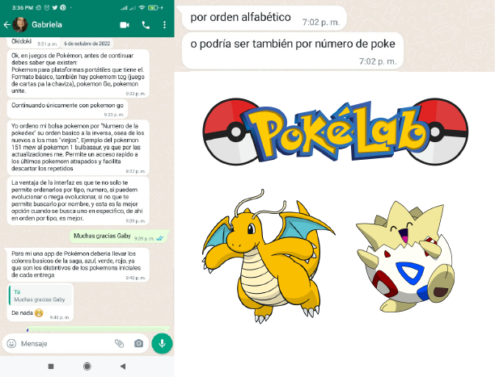

## 2. Prototipado de baja calidad

A la par se comenzo a realizar el prototipado a mano de como nos gustaría que se distribuyera la data o como considerabamos que podría ser de más fácil interacción o lectura. 

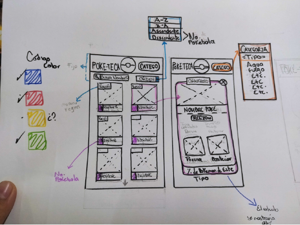

## 3. Historias de usuario 

A continuación, se despliega cada una de nuestras **Historias de Usuario** (estas surgen a partir de cuestionar a diferentes usuarios sobre que es lo que les gustaría ver en una página de Pokemon y que tanto conocen del tema.)

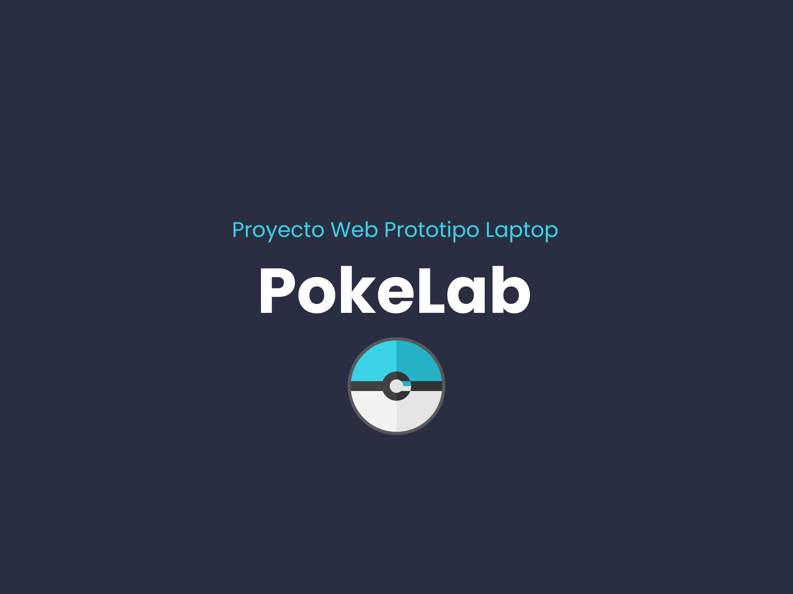   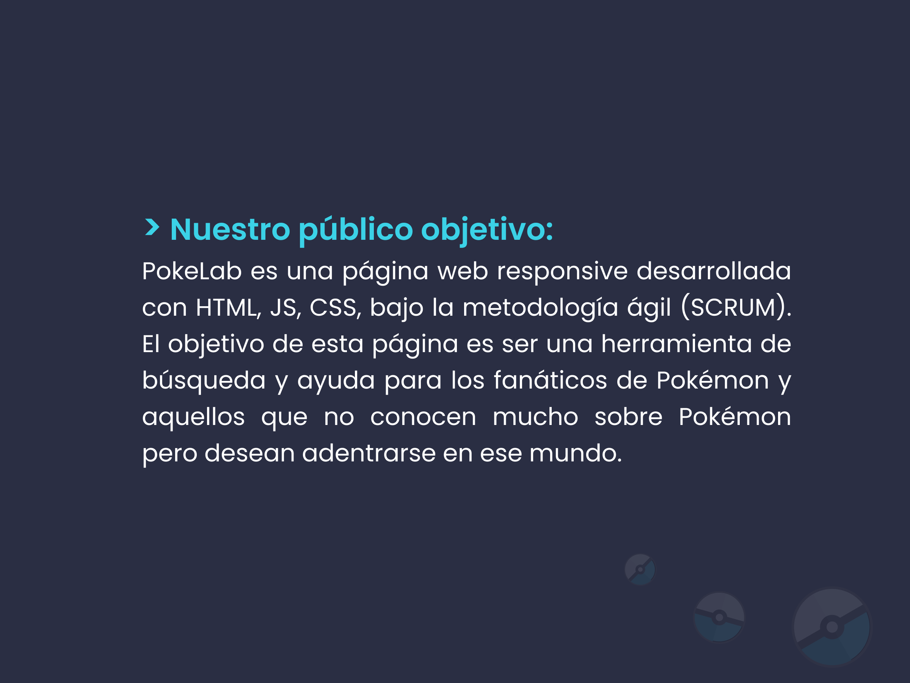
   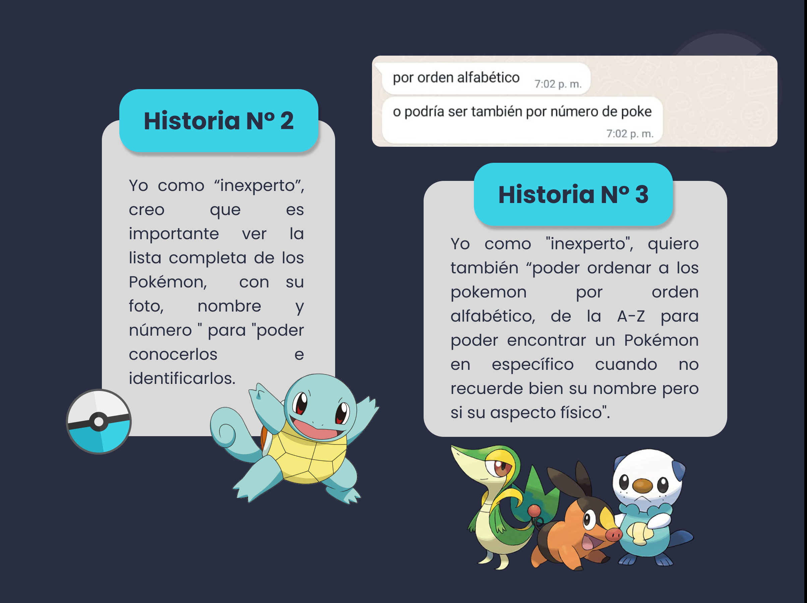
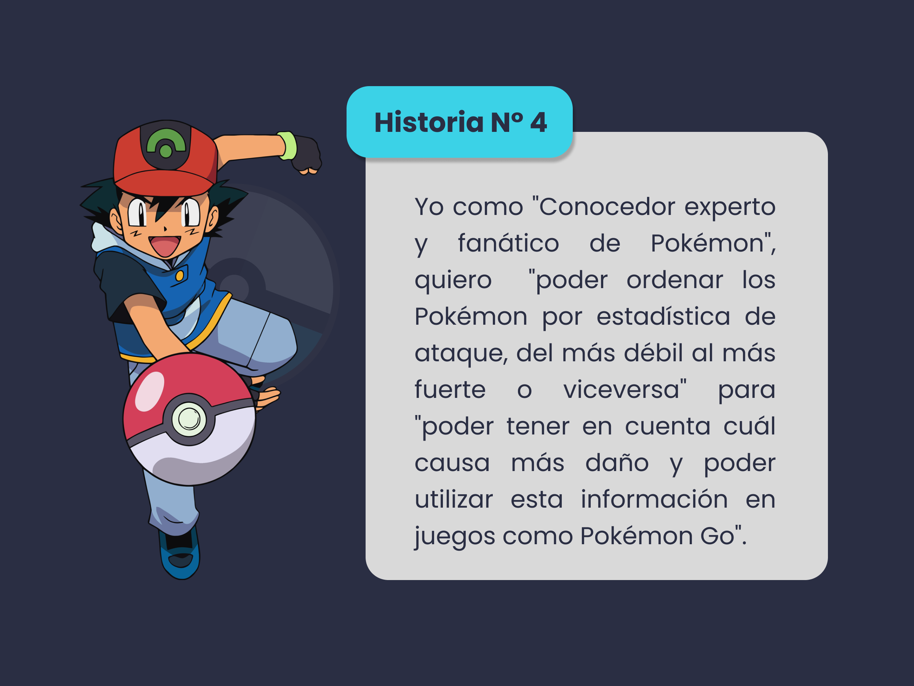   
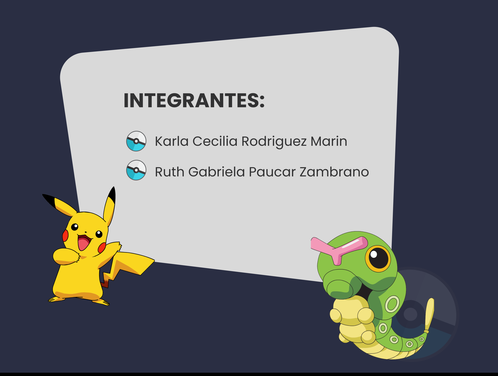   

## 4. Prototipado de **alta calidad**

Se utiliza FIGMA para el prototipado de ALTA CALIDAD.

* Se opta por un diseño **no** saturado, con colores neutros.
* Se da color que distingue a cada **tipo** de pokemon y este código de color también se planea utilizar en los modal y las tarjetas al momento de especificar el tipo de pokemon (así tendrán una referencia visual más rápida).
* Se realiza el prototipado de tres distintos tipos de modal.

   

### Objetivo de la interfaz (expresado en el prototipo de **alta calidad**)

Se muestran aquí el desarrollo que se siguio en el orden en que fue llevado a cabo:

*  **HISTORIA DE USUARIO 2**: Que la data de cada pokemon fuera desplegada en la página mostrando información básica para poder reconocerlos.
* **HISTORIA DE USUARIO 1**: Se puede filtrar por tipo de pokemon, se optó por realizar un "carrusel" con los tipos en la parte superior (header) en lugar de un menu desplegable.
* **HISTORIA DE USUARIO 1**: Se puede buscar cada pokemon por nombre mediante, al ingresar un carácter se va filtrando poco a poco hasta mostrar solo aquel que coincide con el nombre. 
* **HISTORIA DE USUARIO 3**: Cada carta Pokemon puede ser ordenada de la A-Z y la Z-A.
* **FILTRADO POR REGIÓN**: La página puede filtrar entre las dos regiones que incluía la data: Kanto y Johto.
* **ORDENAMIENTO POR NÚM DE POKEDEX**: La página mediante un select ordena los Pokemones del 1 al 250 y viceversa. 
* **ESTADISTICAS por porcentaje de cartas pokemon de cada *tipo***: El usuario puede ver el porcentaje de pokemones de cada tipo (existen 18 tipos distintos entre los 250 pokemones).

## 5. Diseño final del producto:
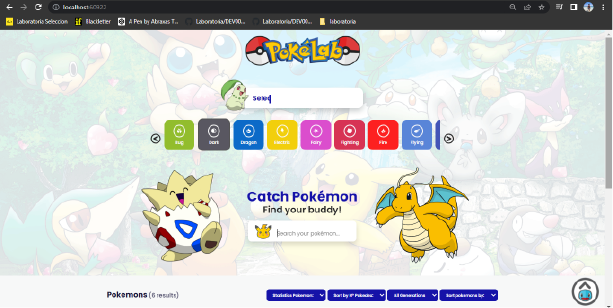
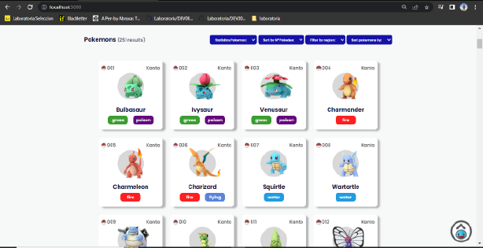
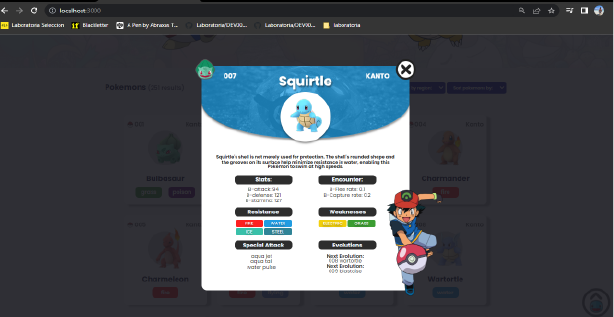

[

### Testeos de usabilidad

Se realizo un último testeo de usabilidad con el producto en un 90% terminado para cersiorarnos que el usuario pudiera manipularlo sin perderse o encontrar posibles fallas. 

## 5. Trello:

Antes de comenzar el prototipado de Alta calidad  se realizo en trello el esquema de tareas/trabajo que realizariamos, dividiendo las tareas mediante etiquetas por historias de usuario y cada paso a seguir para considerarlas terminadas. 

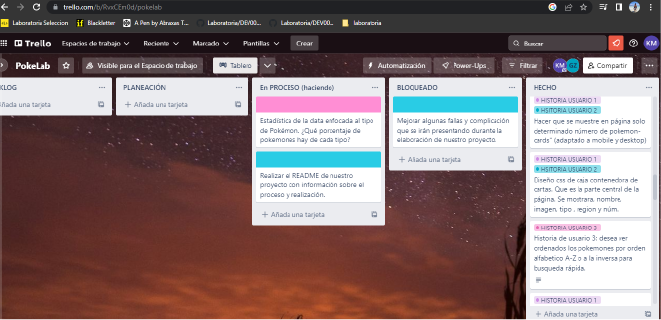
